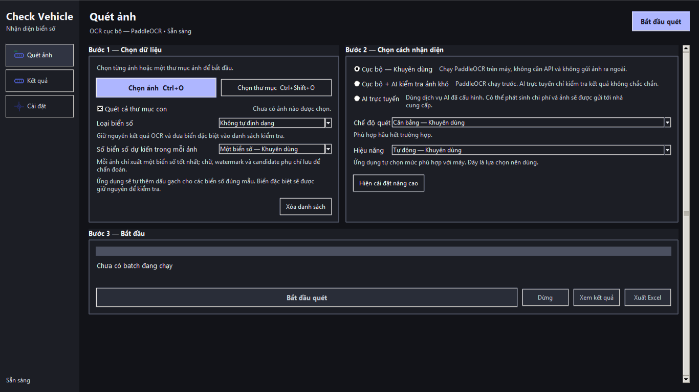

# Check Vehicle OCR

[](https://github.com/NovWyatt/checkparking/releases/latest)
[](https://github.com/NovWyatt/checkparking/releases/latest)
[](pyproject.toml)
[](LICENSE)
[](https://github.com/NovWyatt/checkparking/actions/workflows/ci.yml)

Ứng dụng Windows giúp quét hàng loạt ảnh phương tiện, nhận diện biển số, kiểm tra kết quả và xuất Excel.

**Phiên bản ổn định hiện tại:** v1.9.10

[**⬇️ Tải bản mới nhất**](https://github.com/NovWyatt/checkparking/releases/latest)



## Tính năng chính

### Quét ảnh hàng loạt

- Chọn từng ảnh hoặc cả thư mục, có thể quét các thư mục con.
- Xử lý nhiều ảnh trong một lượt quét, theo dõi tiến trình và xem lại từng kết quả.
- Giao diện tiếp tục phản hồi trong lúc OCR đang chạy.
- Mặc định chỉ xuất một biển số chính cho mỗi ảnh; chế độ nhiều biển chỉ giữ các vùng biển vật lý khác nhau do detector tìm thấy.

### OCR cục bộ

- PaddleOCR 3.7.0, PaddlePaddle 3.3.1 và PaddleX 3.7.2.
- PP-OCRv6 Small là model mặc định; PP-OCRv5 được giữ để quay lại khi cần.
- FAST dùng PP-OCRv6 Tiny; chỉ kết quả có cấu trúc bất thường mới được xác minh một lần bằng PP-OCRv6 Small trên cùng crop biển số.
- Hoạt động trên máy, không cần API key và không cần gửi ảnh ra ngoài.
- PaddleOCR chạy tách biệt khỏi giao diện, với một model được khởi tạo và giữ trong suốt batch.

### Phát hiện vùng biển số

- Detector YuNet từ OpenCV Zoo (Apache-2.0) được đóng gói cùng ứng dụng, không cần tải model ngoài khi quét.
- Pipeline detector-first giúp hạn chế timestamp, watermark, địa chỉ và chữ ngoài biển số.
- Candidate được lọc, chấm điểm và định dạng trước khi chọn kết quả chính.
- Ảnh khó vẫn có bước dự phòng có giới hạn; OCR toàn cảnh không chạy sau khi đã có crop biển hợp lệ.

### Kiểm tra kết quả

- Xem ảnh gốc, crop biển số, OCR nguyên bản, kết quả đã định dạng và độ tin cậy.
- Sửa tay, đánh dấu đã kiểm tra hoặc thêm biển số khi cần.
- Biển đặc biệt và ảnh chưa chắc chắn được tách riêng để đối chiếu.

### Tích hợp tùy chọn

- AI trực tuyến tương thích OpenAI để kiểm tra ảnh khó.
- Tesseract 5.5.3 làm OCR dự phòng.
- Thông báo Telegram theo vòng đời batch.
- Update Center cho ứng dụng, model OCR và component Tesseract.

## Cài đặt

### Cách khuyên dùng

1. Mở trang [Releases](https://github.com/NovWyatt/checkparking/releases/latest).
2. Tải file `CheckVehicleOCR-Setup-<version>.exe` dành cho Windows x64.
3. Chạy installer và hoàn tất các bước cài đặt.
4. Mở **Check Vehicle OCR** từ Start Menu hoặc shortcut đã chọn.

Người dùng thông thường **không cần** cài Python, Visual Studio Code, PaddleOCR, `pip` hoặc Tesseract thủ công.

Windows SmartScreen có thể hiển thị cảnh báo đối với bản chưa được ký số. Hãy kiểm tra nguồn tải là GitHub Releases của `NovWyatt/checkparking` và đối chiếu SHA-256 khi cần.

### Portable

Tải `CheckVehicleOCR-Portable-<version>.zip`, giải nén vào một thư mục riêng rồi chạy `CheckVehicleOCR.exe`. Bản portable phù hợp khi không muốn cài ứng dụng; không chạy trực tiếp EXE từ bên trong file ZIP.

## Sử dụng nhanh

1. Bấm **Chọn ảnh** hoặc **Chọn thư mục**.
2. Chọn loại biển số: **Xe máy**, **Ô tô** hoặc **Không tự định dạng**.
3. Giữ **Một biển số — Khuyên dùng** nếu mỗi ảnh thường chỉ có một xe cần đọc.
4. Chọn **Cục bộ**, **Cục bộ + AI kiểm tra ảnh khó** hoặc **AI trực tuyến**.
5. Chọn chế độ **Nhanh**, **Cân bằng** hoặc **Kỹ**.
6. Bấm **Bắt đầu quét**, sau đó xem và sửa các kết quả cần kiểm tra.
7. Bấm **Xuất Excel** khi đã sẵn sàng.
8. Mở **Đối chiếu** để so kết quả OCR với báo phí, và tùy chọn so thêm với phần mềm.

Khi cần tra cứu batch cũ, vào **Kết quả** và bấm **Mở Excel đã xuất**. Chọn file `.xlsx` do ứng dụng đã xuất để đưa danh sách trở lại màn Kết quả, sau đó tìm kiếm, xem và sửa biển số như bình thường.

## Các chế độ quét

| Chế độ | Phù hợp |
|---|---|
| **Nhanh** | Ít bước xử lý, ưu tiên tốc độ cho ảnh rõ. |
| **Cân bằng — Khuyên dùng** | Phù hợp với đa số bộ ảnh. |
| **Kỹ** | Thử thêm nhiều cách xử lý cho ảnh khó và sẽ chậm hơn. |

FAST và Cân bằng giới hạn ảnh làm việc ở cạnh dài 1280 để xử lý ảnh điện thoại hiệu quả hơn, nhưng kích thước và tọa độ bbox trong kết quả vẫn theo ảnh gốc. Chế độ Kỹ giữ pipeline đầy đủ hơn.

## Loại biển số

Ứng dụng chỉ thêm dấu gạch khi chuỗi OCR khớp đúng cấu trúc đã hỗ trợ.

| Lựa chọn | Ví dụ kết quả |
|---|---|
| **Xe máy** | `59X1-12345`, `59MN-12345` |
| **Ô tô** | `59X-12345` |
| **Không tự định dạng** | Giữ nguyên kết quả OCR để người dùng kiểm tra. |

Chuỗi vẫn có cấu trúc giống biển số nhưng không khớp mẫu chuẩn sẽ không bị ép định dạng. Chúng được giữ trong sheet `Bien_so_dac_biet`; timestamp, watermark và OCR rác bị loại không được đưa vào sheet này.

## OCR cục bộ và AI tùy chọn

**Cục bộ — Khuyên dùng** chạy PP-OCRv6 Small hoàn toàn trên máy. Detector YuNet tìm vùng biển số trước, sau đó PaddleOCR đọc crop và chọn candidate phù hợp nhất.

**Cục bộ + AI kiểm tra ảnh khó** vẫn chạy PaddleOCR trước. Theo chính sách mặc định, AI chỉ nhận ảnh khi kết quả chính không đọc được, có độ tin cậy thấp hoặc thực sự cần kiểm tra; candidate nhiễu đã bị loại không kích hoạt AI.

**AI trực tuyến** dùng provider tương thích OpenAI đã cấu hình. Ứng dụng hỗ trợ:

- Base URL tùy chỉnh;
- API key;
- chọn model hoặc làm mới danh sách model;
- Responses API và Chat Completions theo khả năng của provider.

Ứng dụng vẫn dùng được đầy đủ với OCR cục bộ khi không có AI hoặc API key.

## AI trực tuyến (tùy chọn)

Khi bật chế độ có AI, dữ liệu cần thiết có thể được gửi tới provider do người dùng cấu hình và có thể phát sinh chi phí. Ảnh **không luôn được gửi lên cloud**: ở chế độ cục bộ thì không gửi; ở chế độ hybrid, chỉ các ảnh phù hợp với chính sách kiểm tra mới được gửi.

Hãy xem chính sách dữ liệu, lưu trữ và chi phí của provider trước khi sử dụng. Kiểm thử tự động của dự án dùng mock và không gọi dịch vụ trả phí thật.

## Tesseract dự phòng

Tesseract 5.5.3 là fallback tùy chọn, không phải OCR chính. Khi PaddleOCR đã đọc rõ biển số, Tesseract không được gọi.

Để cài component đã xác minh:

1. Mở **Cài đặt → Cập nhật**.
2. Tại thẻ **Tesseract dự phòng**, bấm **Cài đặt**.
3. Ứng dụng tải component Windows x64 từ release của dự án, kiểm tra SHA-256, cài vào `LocalAppData` và chạy OCR self-test.

Ứng dụng tự lưu đường dẫn component; người dùng không cần sửa `PATH` hoặc tìm `tesseract.exe`. Có thể quay lại bản trước hoặc gỡ component do ứng dụng quản lý. Quy trình build từ source được mô tả trong [tài liệu Tesseract component](docs/TESSERACT_COMPONENT_RELEASE.md).

## Xuất Excel

File Excel hiện có các sheet sau:

- `Tong_quan`: thống kê batch;
- `Theo_tung_anh`: kết quả theo từng file;
- `Bien_so_doc_duoc`: các biển số có thể xuất;
- `Bien_so_dac_biet`: cấu trúc giống biển số nhưng không khớp mẫu chuẩn;
- `So_sanh_OCR`: bằng chứng PaddleOCR/Tesseract khi có đối chiếu;
- `Can_kiem_tra`: ảnh hoặc biển số cần review;
- `Tat_ca_anh`: danh sách toàn bộ ảnh;
- `Review_tat_ca`: chỉ có khi xuất sau bước review.

File Excel giữ OCR nguyên bản, chuỗi đã làm sạch, kết quả đã định dạng, trạng thái review và đường dẫn đối chiếu. Có thể nhúng thumbnail ảnh/crop nếu bật tùy chọn. Các giá trị bắt đầu bằng ký tự công thức được escape để giảm rủi ro Formula Injection.

## Đối chiếu báo phí và phần mềm

Mở mục **Đối chiếu**, chọn file Excel OCR đã duyệt và file báo phí. Có thể bật thêm file phần mềm hoặc chỉ đối chiếu báo phí. Nút **Tải mẫu báo phí** và **Tải mẫu phần mềm** tạo file có sẵn cột `Biển số`; chỉ cần dán dữ liệu vào sheet `Danh_sach` từ dòng 2.

Excel OCR đã duyệt luôn là danh sách gốc. Ứng dụng dò khớp hoàn toàn với báo phí trước; các biển còn lại mới dò với phần mềm nếu được chọn. Khớp gần chỉ được chấp nhận khi có đúng một ứng viên và khác tối đa một ký tự, gồm cả sai ký tự, thiếu hoặc dư một ký tự. Phần đuôi 3 hoặc 4 ký tự được canh chỉnh trước khi kiểm tra, vì thiếu/dư một ký tự có thể làm lệch vị trí. Nhiều ứng viên hoặc khác biệt lớn hơn một ký tự được đưa vào sheet `Cần_xác_nhận`. Biển đã khớp báo phí không được dò lại với phần mềm.

Trong **Kết quả**, ô Crop biển số ưu tiên file crop do OCR tạo. Khi mở lại Excel đã xuất, ứng dụng khôi phục đường dẫn crop từ sheet `Bien_so_doc_duoc` nếu file crop vẫn còn. Nếu không có file này nhưng detector đã trả vùng biển số, ứng dụng sẽ cắt trực tiếp từ ảnh gốc để hiển thị. Trường hợp Excel cũ không có crop, không còn ảnh gốc hoặc không có vùng biển số thì crop không thể khôi phục.

## Telegram

Telegram không bắt buộc. Khi được bật và cấu hình, ứng dụng có thể gửi thông báo:

- bắt đầu batch;
- tiến độ theo mốc phần trăm;
- hoàn tất hoặc dừng;
- lỗi batch.

Có tùy chọn che biển số trong thông báo. Việc gửi chạy nền; lỗi Telegram không làm dừng OCR.

## Cập nhật

Update Center quản lý bốn nhóm cập nhật có kiểm chứng:

- ứng dụng Check Vehicle OCR;
- PaddleOCR runtime đi cùng bản phát hành ứng dụng đã kiểm thử;
- model OCR đã đóng gói;
- component Tesseract dự phòng.

Nguồn mặc định của bản đóng gói là GitHub Releases tại `NovWyatt/checkparking`. Gói tải về phải có SHA-256 phù hợp; model và Tesseract dùng manifest riêng, thư mục versioned, bước kiểm tra trước khi kích hoạt và khả năng quay lại bản trước.

Với bản đã đóng gói, người dùng chủ động kiểm tra, tải và xác nhận cài đặt. Trình hỗ trợ chỉ chạy installer đã xác minh sau khi ứng dụng đóng, kiểm tra sức khỏe bản mới và khôi phục bản trước nếu cài đặt thất bại. Bản chạy từ source không tự cài cập nhật.

PaddleOCR runtime được nâng qua bản phát hành ứng dụng đã kiểm thử, không tự chạy `pip upgrade` trong bản production.

## Quyền riêng tư

- PaddleOCR và Tesseract xử lý local; ảnh không cần upload khi chỉ dùng OCR cục bộ.
- Nếu bật AI trực tuyến, dữ liệu cần thiết được gửi tới provider đã cấu hình theo chế độ và chính sách đã chọn.
- Telegram chỉ gửi thông báo theo các tùy chọn người dùng bật.
- Khi người dùng chọn lưu khóa, ứng dụng dùng Windows DPAPI khi khả dụng; không nên chia sẻ file cài đặt hoặc log có dữ liệu nhạy cảm.

Không có tuyên bố bảo mật tuyệt đối. Hãy dùng provider và Telegram phù hợp với chính sách dữ liệu của tổ chức bạn.

## Hiệu năng

Benchmark acceptance nội bộ của v1.9.3 trên 72 ảnh 1920×2560 ghi nhận:

- FAST packaged: khoảng **123,5 giây**;
- throughput: khoảng **35 ảnh/phút**;
- kết quả: **70 primary / 2 review**;
- heartbeat giao diện p95: khoảng **6,1 ms**;
- số lần block trên 100 ms: **0**.

PaddleOCR chạy trong một subprocess riêng để giảm hiện tượng đứng/khựng giao diện. FAST/Cân bằng dùng ảnh làm việc tối đa 1280 ở cạnh dài; chế độ Kỹ ưu tiên pipeline đầy đủ hơn.

> Đây là benchmark nội bộ, không đại diện cho mọi máy hoặc mọi bộ ảnh và không phải tuyên bố độ chính xác trên dữ liệu thực tế.

Chi tiết xem [báo cáo v1.9.3](docs/v1.9.3-ocr-subprocess-release-report.md) và [báo cáo tối ưu ảnh độ phân giải cao](docs/high-resolution-performance-fix-release-report.md).

## Chạy từ source

Windows là platform production chính. Source yêu cầu Python 3.11 hoặc 3.12 và Git LFS để lấy đầy đủ model weights.

```powershell
git lfs pull
python -m venv .venv
.\.venv\Scripts\Activate.ps1
python -m pip install --upgrade pip
python -m pip install -r requirements-dev.txt
python -s main.py
```

Không dùng API/Telegram thật khi phát triển nếu không cần thiết. Cấu hình người dùng được lưu ngoài thư mục mã nguồn.

## Build Windows

Build installer cần Inno Setup 6. Chạy từ PowerShell tại thư mục gốc:

```powershell
.\build_exe.ps1
.\build_installer.ps1 -SkipExeBuild
.\build_release_assets.ps1 -SkipBuild
```

Tệp đầu ra chính:

- `release/CheckVehicleOCR/CheckVehicleOCR.exe`;
- `installer/Output/CheckVehicleOCR-<version>-windows-x64-setup.exe`;
- `release-assets/CheckVehicleOCR-Portable-<version>.zip`;
- manifest và `SHA256SUMS.txt` trong `release-assets/`.

`build_release_assets.ps1` yêu cầu component Tesseract và manifest đã được xác minh. Release workflow trên GitHub Actions build component này trước khi đóng gói ứng dụng.

## Kiểm thử

Kiểm tra nhanh sau khi thiết lập môi trường:

```powershell
.\.venv\Scripts\python.exe -B -m compileall -q check_vehicle_ocr tests tools main.py
.\.venv\Scripts\python.exe -B tests\smoke_test.py
```

Bộ kiểm thử đầy đủ và các cổng kiểm tra phát hành được định nghĩa trong [CI](.github/workflows/ci.yml) và [Release Windows](.github/workflows/release.yml). Theo [báo cáo phát hành v1.9.3](docs/v1.9.3-ocr-subprocess-release-report.md), bản này đã pass compileall, 34/34 test scripts, packaged health, Paddle self-test, UI assertion và installer install/health/uninstall.

Kiểm thử tự động không gọi API hoặc Telegram thật và không dùng dataset ảnh riêng tư.

## Cấu trúc repository

```text
.github/workflows/   CI và quy trình phát hành Windows
assets/              Icon và fixture component
check_vehicle_ocr/   Source ứng dụng
docs/                Tài liệu kỹ thuật và báo cáo phát hành
installer/           Cấu hình Inno Setup
models/              Model metadata và weights qua Git LFS
tests/               Automated tests và benchmark harness
tools/               Công cụ build, kiểm tra và chụp UI
main.py              Entry point khi chạy source
build_*.ps1          Script build Windows
```

## Tài liệu

- [Latest Release](https://github.com/NovWyatt/checkparking/releases/latest)
- [Changelog](CHANGELOG.md)
- [Security Policy](SECURITY.md)
- [Thiết lập AI provider](docs/AI_PROVIDER_SETUP.md)
- [Hệ thống cập nhật](docs/UPDATE_SYSTEM.md)
- [Tesseract component](docs/TESSERACT_COMPONENT_RELEASE.md)
- [Báo cáo phát hành v1.9.3](docs/v1.9.3-ocr-subprocess-release-report.md)
- [Báo cáo hiệu năng ảnh độ phân giải cao](docs/high-resolution-performance-fix-release-report.md)

## License

Mã nguồn riêng của repository được phát hành theo [MIT License](LICENSE). PaddleOCR, PaddlePaddle, Tesseract, model và các dependency khác giữ license/notice riêng; xem [THIRD_PARTY_NOTICES.md](THIRD_PARTY_NOTICES.md).
